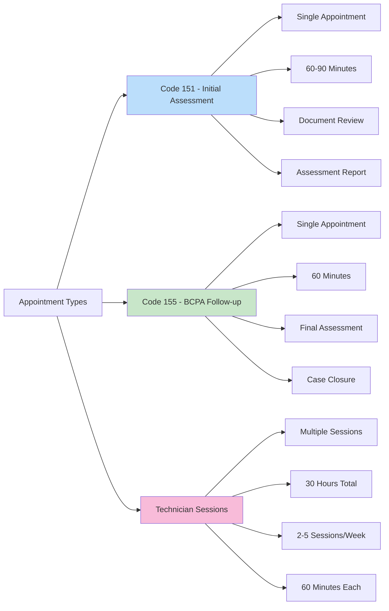
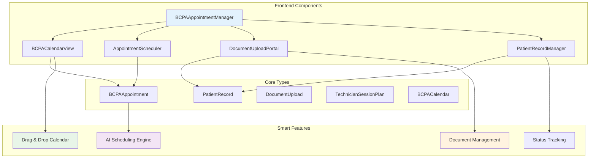
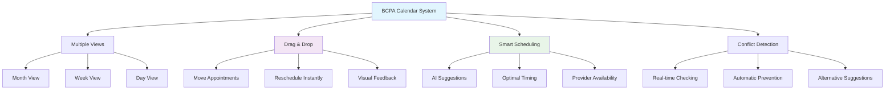
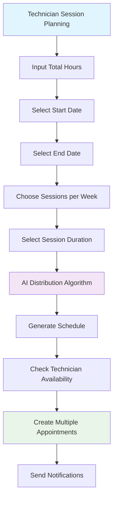
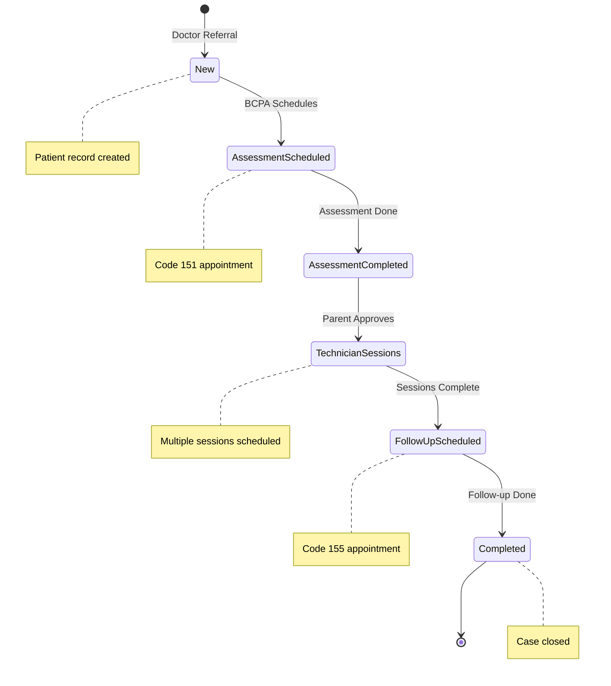

# BCPA Appointment Workflow Diagram

## Complete Workflow Overview

```mermaid
graph TD
    A[Doctor Recommends BCPA] --> B[Parent Calls Office]
    B --> C[BCPA Admin Receives Call]
    C --> D[Create Patient Record]
    D --> E[Schedule Initial Assessment - Code 151]
    E --> F[Send Portal Link to Parent]
    F --> G[Parent Uploads Documents]
    G --> H[BCPA Reviews Documents]
    H --> I[Initial Assessment Appointment]
    I --> J[BCPA Completes Assessment]
    J --> K[Generate Assessment Report]
    K --> L[Parent Reviews & Signs Report]
    L --> M[Submit to Insurance]
    M --> N[Parent Calls for Next Steps]
    N --> O[Schedule Technician Sessions]
    O --> P[Plan 30 Hours Across Months]
    P --> Q[Distribute Sessions Automatically]
    Q --> R[Technician Sessions Begin]
    R --> S[Monitor Session Progress]
    S --> T[Schedule BCPA Follow-up - Code 155]
    T --> U[BCPA Follow-up Appointment]
    U --> V[Final Assessment]
    V --> W[Case Completion]

    style A fill:#e1f5fe
    style E fill:#f3e5f5
    style I fill:#f3e5f5
    style O fill:#e8f5e8
    style R fill:#e8f5e8
    style T fill:#f3e5f5
    style W fill:#e8f5e8
```

## Appointment Types and Codes

## System Architecture

## Calendar System Features

## Document Management Flow

```mermaid
graph LR
    A[Parent Receives Portal Link] --> B[Secure Login]
    B --> C[Document Upload Interface]
    C --> D[File Selection]
    D --> E[Category Selection]
    E --> F[Upload Progress]
    F --> G[BCPA Review Queue]
    G --> H[Document Approval]
    H --> I[Patient Record Updated]
    
    style A fill:#e3f2fd
    style G fill:#fff3e0
    style I fill:#e8f5e8
```

## Technician Session Planning

## Status Workflow

This comprehensive BCPA Appointment Workflow System provides a complete solution for managing the entire patient journey from initial referral to treatment completion, with intelligent scheduling, document management, and calendar integration.

