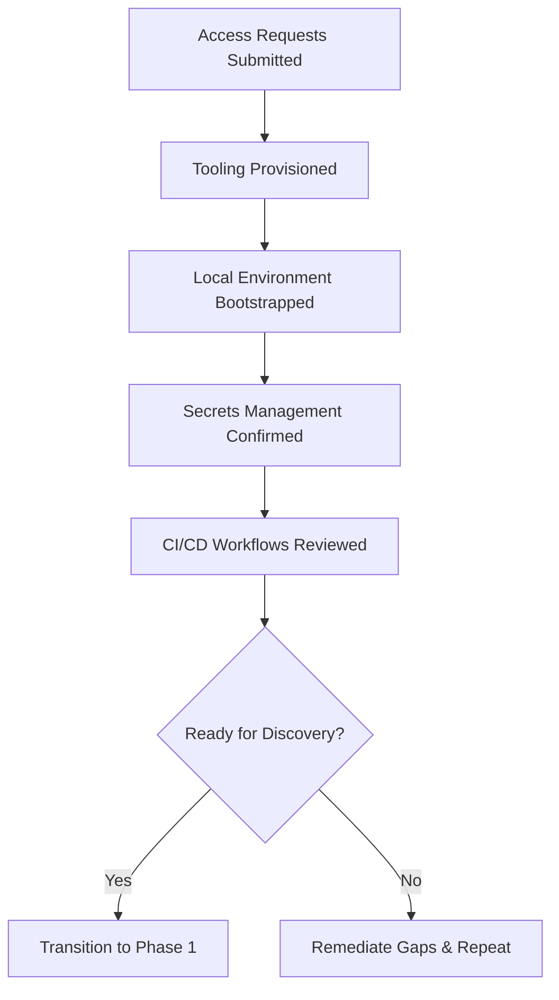
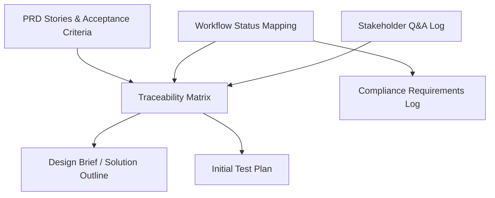
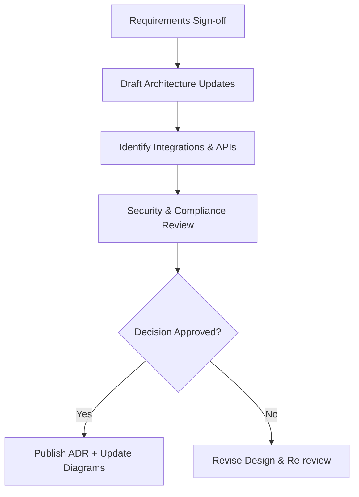
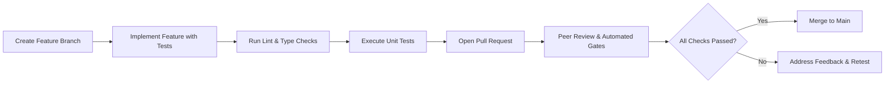
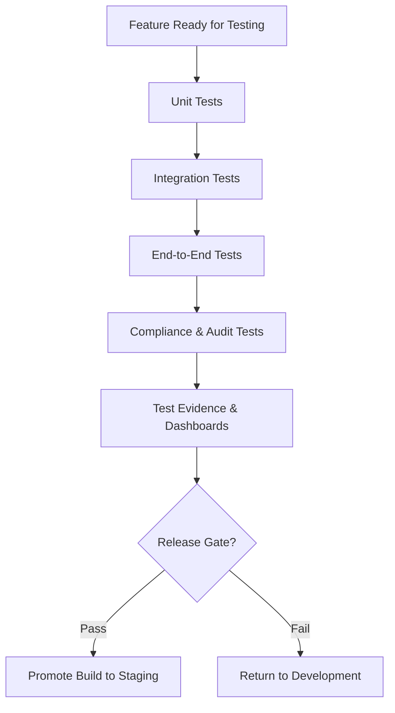
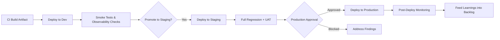
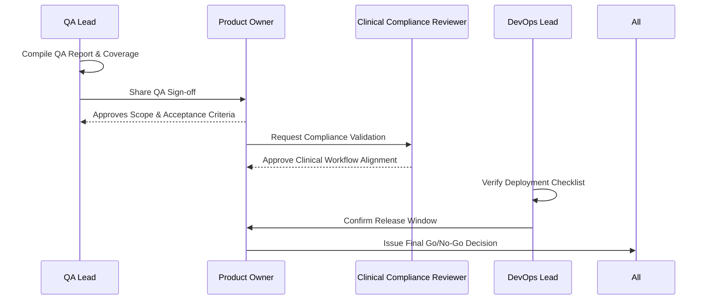
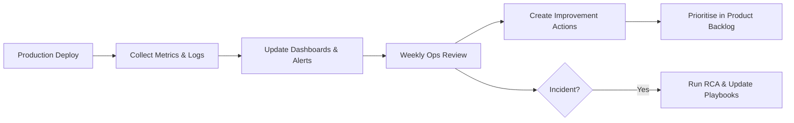
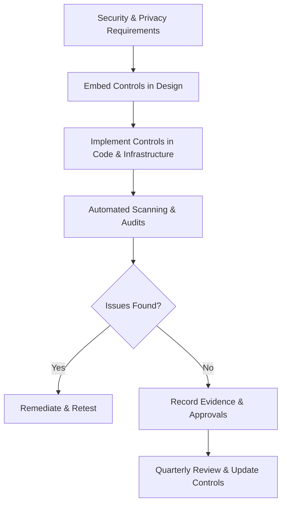
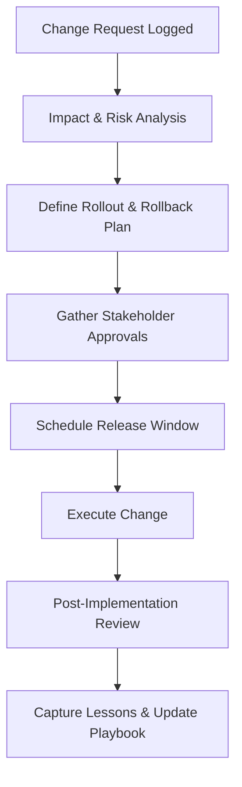

# Wabi Care Software Lifecycle Playbook (Consultant Edition)

## 1. Purpose and Scope
- Provide a single source of truth for the software lifecycle from discovery through post-production operations.
- Establish mandatory checkpoints consultants must follow to stay aligned with Wabi Care clinical workflow, healthcare compliance, and release governance.
- Reference existing product requirement documents (PRDs), technical specs, and architectural diagrams kept under `wabi-care-ui/docs`.

## 2. Governance and Roles
- **Product Owner (Wabi Care)**: Owns roadmap, approves scope changes, validates PRD alignment.
- **Solution Architect (Consultant)**: Translates requirements into technical design, enforces architecture guardrails.
- **Tech Lead (Consultant)**: Oversees implementation quality, code review standards, and automation adoption.
- **QA Lead (Consultant)**: Designs test strategy, verifies traceability to PRDs and regulatory requirements.
- **DevOps Lead (Consultant)**: Maintains CI/CD pipelines, environment configuration, and release readiness.
- **Clinical Compliance Reviewer (Wabi Care)**: Confirms workflow alignment with Initial Assessment (151), Follow-up Assessment (153), and Final Follow-up (155) phases before go-live.

## 3. Core Artefacts
- Product requirement documents located under `wabi-care-ui/docs/**/PRD.md` (baseline scope & acceptance criteria).
- Technical specifications and architecture diagrams (`docs/design` and `docs/mvp`) used for solution design.
- Sprint-level planning documents (roadmap, phased architecture) to inform prioritisation.
- Test plans, traceability matrices, and QA sign-off reports stored alongside feature branches.

### Lifecycle Overview Diagram
```mermaid
flowchart LR
    Onboard["Phase 0\nOnboarding & Env Prep"] --> Discovery["Phase 1\nRequirements & Discovery"]
    Discovery --> Design["Phase 2\nSolution Design & Architecture"]
    Design --> Dev["Phase 3\nDevelopment Standards"]
    Dev --> Test["Phase 4\nTesting & Automation"]
    Test --> Deploy["Phase 5\nDevOps & Deployment Pipeline"]
    Deploy --> ReleaseDoc["Phase 6\nRelease Validation & Documentation"]
    ReleaseDoc --> Ops["Phase 7\nOngoing Operations & Monitoring"]
    Ops --> Compliance["Phase 8\nSecurity, Privacy & Compliance"]
    Compliance --> Change["Phase 9\nChange Management & Sign-off"]
    Change --> Checklist["Phase 10\nPhase Checklists & Continuous Improvement"]
    Click Onboard "Phase 0: Onboarding and Environment Preparation" _blank
    Click Discovery "Phase 1: Requirements and Discovery" _blank
    Click Design "Phase 2: Solution Design and Architecture" _blank
    Click Dev "Phase 3: Development Standards" _blank
    Click Test "Phase 4: Testing Strategy and Automation" _blank
    Click Deploy "Phase 5: DevOps and Deployment Pipeline" _blank
    Click ReleaseDoc "Phase 6: Release Validation and Documentation" _blank
    Click Ops "Phase 7: Ongoing Operations and Monitoring" _blank
    Click Compliance "Phase 8: Security, Privacy, and Compliance Controls" _blank
    Click Change "Phase 9: Change Management and Sign-off Process" _blank
    Click Checklist "Phase 10: Phase Checklists" _blank
```

## 4. Phase 0: Onboarding and Environment Preparation
- Confirm access to GitHub/Vercel, project management tools, and documentation repositories.
- Bootstrap dev machines with Node.js LTS, pnpm/npm, linting/prettier configs, and VS Code settings used by Wabi Care.
- Sync with DevOps lead on environment variables, secrets storage (prefer Vault/parameter store), and secure credentials handling.
- Review existing CI workflows (GitHub Actions) and deployment policies to Vercel.

### Cookbook Flow


## 5. Phase 1: Requirements and Discovery
- Read relevant PRDs and clarify success metrics, personas, and compliance constraints.
- Map business workflow requirements to the care delivery pipeline statuses: New → Assessment Scheduled → Assessment Completed → In Sessions → Follow-up Scheduled → Completed.
- Create requirement traceability matrix linking PRD features to design, code modules, and test cases.
- Document open questions and align on definition of done before design starts.

### Artefact-to-Workflow Map


## 6. Phase 2: Solution Design and Architecture
- Produce/update architecture diagrams referencing `docs/design/architecture.md` and `docs/converted_documents/architecture.md`.
- Define service boundaries, data flow, and integration points (calendar, authorization tracking, document verification).
- Conduct design reviews with Product Owner and Clinical Compliance Reviewer; capture decisions in ADR format.
- Validate alignment with AI-powered scheduling, patient record management, and outcome analysis integrations.

### Decision Flow


## 7. Phase 3: Development Standards
- Follow trunk-based development with short-lived feature branches; enforce conventional commit messages.
- Implement feature toggles for incomplete functionality; avoid long-running branches.
- Adhere to TypeScript strict typing, linting (`eslint`, `prettier`), and domain-driven folder structure already in `src`.
- Maintain comprehensive inline documentation for clinical workflows, especially around Initial Assessment (151), Technician Sessions, Follow-up Assessment (153), and Final Follow-up (155).
- Require peer reviews with automated checks (lint, tests, type checks) before merge.

### Developer Cookbook


## 8. Phase 4: Testing Strategy and Automation
- **Unit tests**: Use Jest/React Testing Library with ≥80% coverage on new modules.
- **Integration tests**: Validate scheduling workflows, patient status transitions, and document verification flows with Supabase mocks.
- **End-to-end tests**: Execute Playwright/Cypress suites covering booking, outcome analysis, and document upload journeys.
- **Compliance tests**: Confirm healthcare authorization tracking, PHI handling, and audit logging per workflow phase.
- Automate test execution in CI for every pull request; block merges on failed checks.
- Maintain regression suite baseline and update traceability matrix after each release candidate.

### Test Automation Ladder


## 9. Phase 5: DevOps and Deployment Pipeline
- Maintain infrastructure as code for shared services (Terraform/Pulumi) and document environment configs under `docs/scaleup`.
- Use GitHub Actions for build, test, security scans (Snyk, Dependabot), and artifact promotion.
- Implement staged deployments: `dev` → `staging` → `production`, with manual approval gates led by Wabi Care stakeholders.
- Ensure Vercel deployments reference immutable commit SHAs; enable automatic rollbacks for failed health checks.
- Document deployment runbooks, including rollback steps and incident contacts.

### Deployment Conveyor


## 10. Release Validation and Documentation
- Prepare release notes mapping features to PRDs and linked Jira/Linear tickets.
- Capture validation evidence: QA sign-off, business UAT, and compliance approvals.
- Update clinical workflow documentation to reflect new functionality impacting status transitions or assessments.
- Archive release bundles, test reports, and sign-offs in the shared document repository.

### Sign-off Swimlane


## 11. Ongoing Operations and Monitoring
- Instrument application with observability (Logs, Metrics, Traces) using tools such as Datadog or New Relic.
- Monitor scheduling throughput, patient progression through workflow phases, and authorization resolution times.
- Establish SLIs/SLOs for uptime, response times, and clinical document processing latency.
- Run weekly post-deployment reviews to assess incident tickets, regressions, and improvement actions.

### Monitoring Cookbook


## 12. Security, Privacy, and Compliance Controls
- Enforce least privilege access and MFA on all tooling.
- Conduct security scanning (SAST, DAST) each sprint; remediate critical issues before release.
- Maintain HIPAA-aligned PHI handling: encrypt data at rest/in transit, log access, and restrict PII exposure in logs.
- Verify document verification pipeline, authorization tracking, and patient record synchronization for each release cycle.
- Perform quarterly audits of workflow status transitions to ensure compliance with Initial and Follow-up assessments.

### Compliance Loop


## 13. Toolchain and Automation Expectations
- Source control: GitHub with protected `main` branch, required reviews, and status checks.
- CI/CD: GitHub Actions, Vercel for frontend deployments, Terraform for shared infrastructure.
- Testing: Jest, React Testing Library, Playwright/Cypress, contract testing for API integrations.
- Documentation: Markdown in `docs`, ADRs, and Confluence (if shared).
- Communication & tracking: Slack/Teams for stand-ups, Jira/Linear for backlog, and Notion for knowledge base.

## 14. Change Management and Sign-off Process
- Submit change request detailing impacted workflow phases, risk assessment, and rollback plan.
- Secure approvals from Product Owner, Tech Lead, QA Lead, and Clinical Compliance Reviewer.
- Schedule releases during defined windows with stakeholder notification.
- Post-release, complete change review documenting outcomes, incidents, and patient impact.

### Change Approval Path


## 15. Phase Checklists
- **Discovery Complete**: PRDs reviewed, traceability matrix drafted, open questions resolved.
- **Design Complete**: Architecture validated, integration points documented, compliance review passed.
- **Development Complete**: Code merged to `main`, automated checks green, documentation updated.
- **Testing Complete**: Unit/integration/E2E coverage met, regression suite passed, QA sign-off recorded.
- **Deployment Complete**: Staged promotions successful, monitoring configured, runbook updated.
- **Post-Release Complete**: Metrics reviewed, incidents closed, lessons learned catalogued.

## 16. Reference Library
- `docs/design/PRD.md` – Core product requirements and user stories.
- `docs/design/TECHNICAL_SPEC.md` – Detailed technical specs and integration contracts.
- `docs/converted_documents/architecture.md` – High-level system diagram.
- `docs/mvp/TECHNICAL_SPEC.md` – MVP baseline for smart scheduling and AI workflows.
- `roadmap-phased-architecture.md` – Future phases and scaling considerations.

## 17. Cookbook Quick Reference
| Phase | Trigger | Do This | Produce | Exit Criteria |
| --- | --- | --- | --- | --- |
| Phase 0 | Access Granted | Bootstrap env, confirm secrets, review CI | Onboarding checklist | All tooling operational |
| Phase 1 | Onboarding complete | Review PRDs, map workflows, build traceability | Traceability matrix, discovery log | Definition of done agreed |
| Phase 2 | Discovery complete | Draft architecture, validate compliance | ADRs, updated diagrams | Design review sign-off |
| Phase 3 | Design approved | Develop feature branches, run static checks | Feature PR, unit tests | PR merged with green checks |
| Phase 4 | Feature merged | Execute test ladder, collect evidence | Test reports, dashboards | QA sign-off |
| Phase 5 | QA sign-off | Promote builds through stages, update runbooks | Deployment checklist | Production release window |
| Phase 6 | Deploy scheduled | Publish release notes, collect approvals | Release packet, compliance approvals | Go/No-Go issued |
| Phase 7 | Release live | Monitor KPIs, run ops review | Observability dashboards, incident log | SLOs within thresholds |
| Phase 8 | Ops review | Run security scans, audit workflows | Compliance report | No outstanding critical issues |
| Phase 9 | Change initiated | Log change, secure approvals, execute | Change record, RCA if needed | Lessons incorporated |

---
**Action for Consultants**: Acknowledge receipt, align your delivery playbook to this lifecycle, and review compliance checkpoints with the Wabi Care Clinical Compliance Reviewer before starting any sprint.
